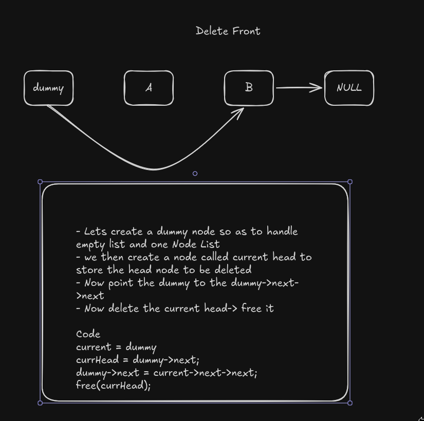

# Delete from front
Here we are dealing with deleting the node from the front(Head) of the list.

Lets start with the structure as usual
```c
struct Node {
    int Data;
    struct Node *next;
}
```

A structure called `Node`, consisting of two parts:
- The Data part used for storing the values of the node
- The pointer part for pointer to the next node, using it's memory address

## Steps to complete this challenge
1. We include the header files for both `I/O` operations and memory management
```c
#include <stdio.h>
#include <stdlib.h>
```

2. We create a function to handle the deleteFront, here it has one parameter only
- `dummy`: a Node that helps us manage the head or start of the List, catering for edge cases.

```c
void deleteBack(struct Node *dummy)
```

3. Now we create a current Head Node to grab the head to be deleted.
```c
struct Node *currHead = dummy->next;
```

4. We now point the `dummy->next` to the next next Node. so as the `dummy->next` can be deleted.
```c
dummy->next = dummy->next->next;
```

5. delete the current head, in c, simply free it.
```c
free(currHead);
```

Just like that deleteFront has been implemented successfully.

Full code below.
```c
void deleteFront(struct Node *dummy){
    struct Node *currHead = dummy->next;
    dummy->next = dummy->next->next;
    free(currHead);
}
```

For visualization, refer to the following


Documented By: [Tom](https://github.com/tomi3-11)
