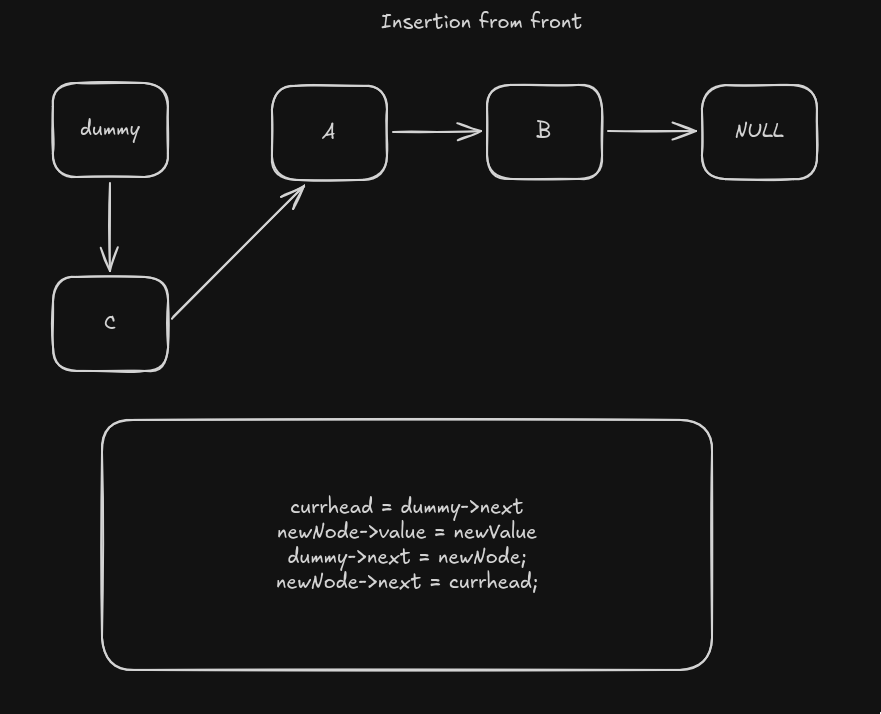

# insertion from Front
Here we try to insert the node from the front, making the new node become the head and pointing to the prevoius head.

### Steps used
We have a dummy node to help us with the node that points to head and handle some edge cases.

we first have a structure called `Node`.
```c
struct Node {
    int Data;
    struct Node *next;
};
```

Then our function is mapped this way;

```c
void insertFront(struct Node *dummy, int value);
```

1. First keep the current head in node to be used later
```c
struct Node *currHead = dummy->next;
```
2. Now we add the new value to the node's data position
```c
// create a new node
struct Node *newNode = malloc(sizeof(struct Node));

// now add the value
newNode->Data = value;
```
3. We now point the dummy (Our dummy node that handles edge cases for empty list) to the new node.
```c
dummy->next = newNode;
```
4. The finally point the newNode to the prevoius head
```c
newNode->next = currHead;
```

Just like that, you have implemented the insert from front.

for visualization, see this below


Documented by: [Tom](https://github.com/tomi3-11)
