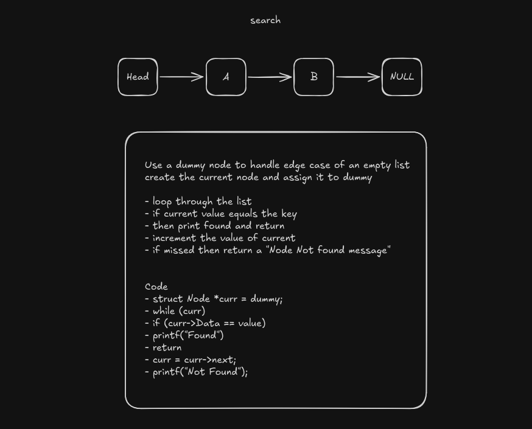

# Linear search in LinkedList
We perform simple linear search on the linkedlist we created.

we need a structure for our node called `Node`.
```c
struct Node {
    int Data;
    struct Node *next;
};
```

Now we can create the function structure 
```c
void search(struct Node *head, int Key);
```
The funtion has 2 parameters:
- `head`: simply represent the start of the node for movement through the list
- `Key`: represents the value to be searched in the list.

## Steps to solve this problem
1. Create a node name `current` to track each node during traversal
```c
struct Node *current = head;
```

2. Loop through the whole list as long as current is not null
```c
while (current)
```
3. Check if the current Node's data is equivalent to the key
```c
if (current->Data == Key)
```
4. Display a message and return to quit the function.
```c
printf("Found: %d", Key);
return
```
5. Increment the value of current to move forward
```c
current = current->next;
```
6. If the while loop goes until the last node then that means the key is not found, now display a message for the user
```c
printf("Not found: %d", Key);
```

All done, you have successfully implemented a linear search on linkedlist

For visual purposes, use this:


Documented By: [Tom](https://github.com/tomi3-11)
